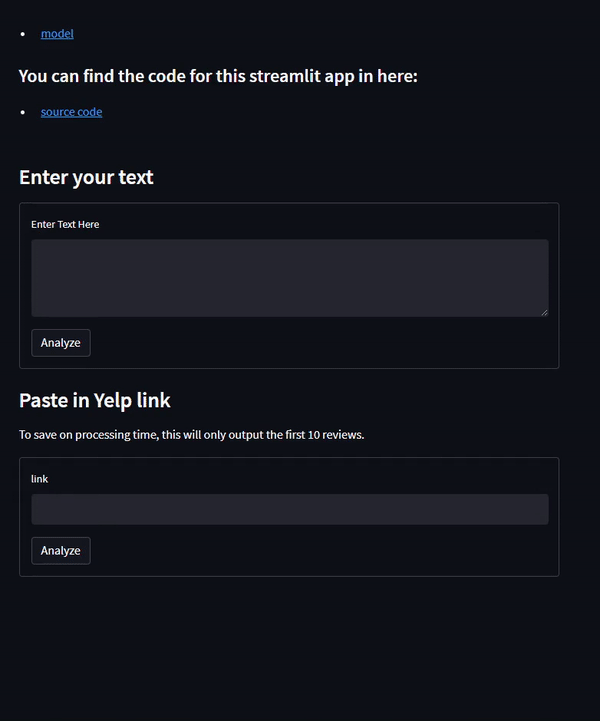
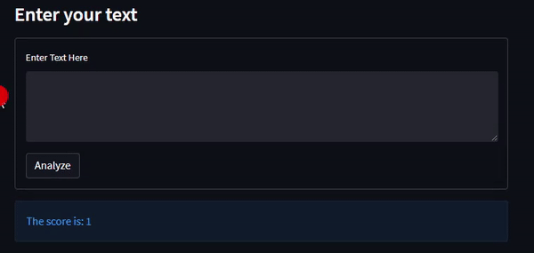

# What is this
This is a basic implementation of sentimeent analysis using a pretrained BERT model from the huggingface library. The model has been finetuned for product reviews which is why I chose it for doing sentiment analysis on resturants on the yelp site.  

I then made a web app using the module `streamlit`  
[Try out the app here :+1: ](https://elpatatone-sentiment-analysis-bert-app-ctid3i.streamlitapp.com)

### Demo
#### User input

#### Yelp link

