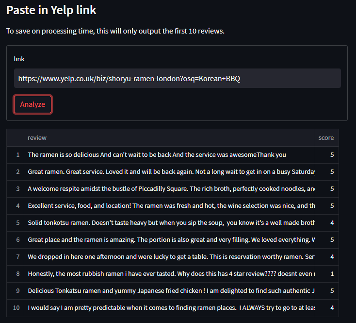

# What is this
This is a basic implementation of sentiment analysis using a pretrained `BERT`  model from the `huggingface`  library. 
The model has been finetuned for product reviews which makes it perform better when doing sentiment analysis on resturants reviews on a yelp site.  

You can find the model used here: [model](https://huggingface.co/nlptown/bert-base-multilingual-uncased-sentiment)

I then made a web app using the module `streamlit`  
[Try out the app here :+1: ](https://elpatatone-sentiment-analysis-bert-app-ctid3i.streamlitapp.com)  

The program will scrape the yelp site that you paste in and it will return the first 10 reviews. The reviews will then be given a score
from 1 to 5 depending on the sentiment analysis model evaluations.

### Sceenshot of the app

### ISSUE
The streamlit app will sometimes stop working due to errors when it comes to loading in the required depencies for the program. I have not been
able to figure out a solution as of yet.
